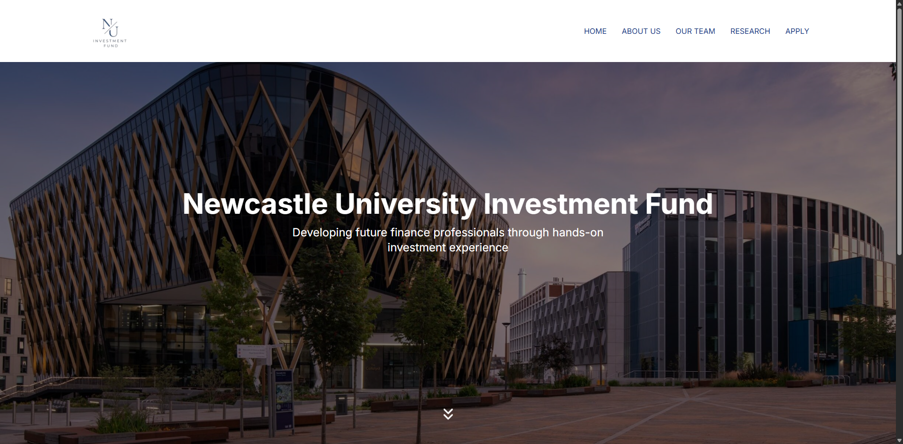

# NUIF Website

Main website designed to showcase the fund’s mission, team members, and investment research.

# Development

## Setup

This project takes advantage of TypeScript, React and Next.JS, therefore in order to correctly set up the project you
must first install the required dependencies using `pnpm install`.

This project also uses a Python script therefore you must have Python installed, and you must run
`pip install -r requirements.txt` or it will not build.

## Development

In order to test your changes you can run `pnpm dev` and a Next.JS development server will be loaded consequently.

## Build

In order to build the project once you have set it up you can run `pnpm build` and NextJS will build the site creating
static/dynamic routes where required.

## Hosting

The site is hosted using [Vercel](https://vercel.com/), you can link a GitHub repository to host a copy of this site or
you can build the site and host it with a reverse-proxy such as Traefik or Nginx.

# Website

https://newcastleuniversityinvestmentfund.com/

# Authors

Samraat Jain, James Delin, Sarah Rafiepour, Ryan Duong, Shalom Ademuwagun
